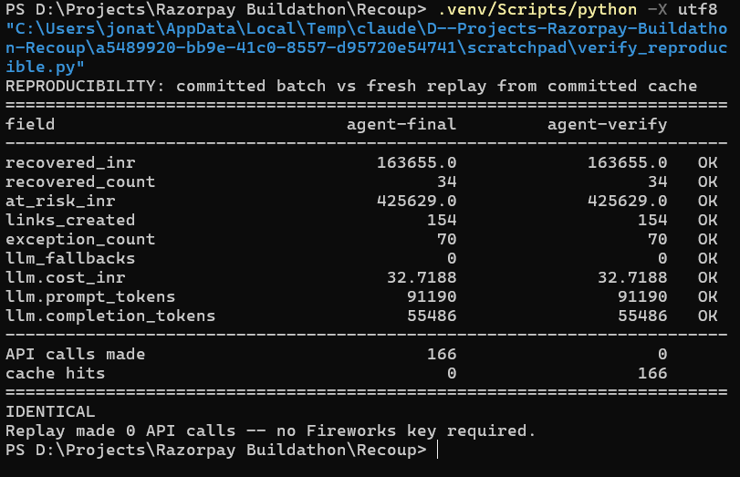
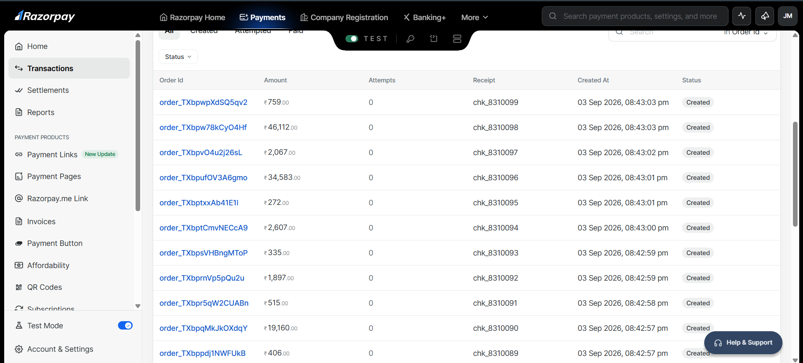
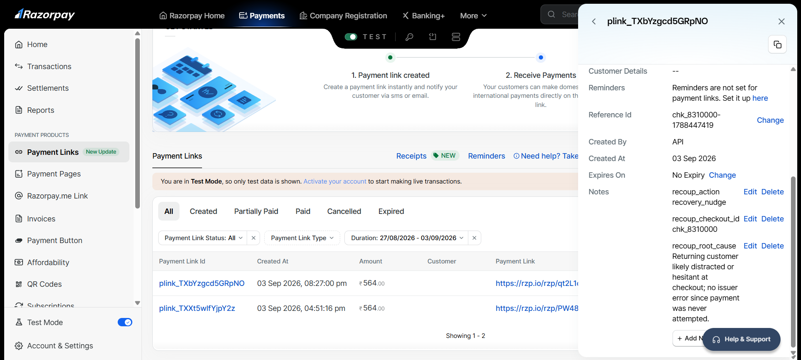
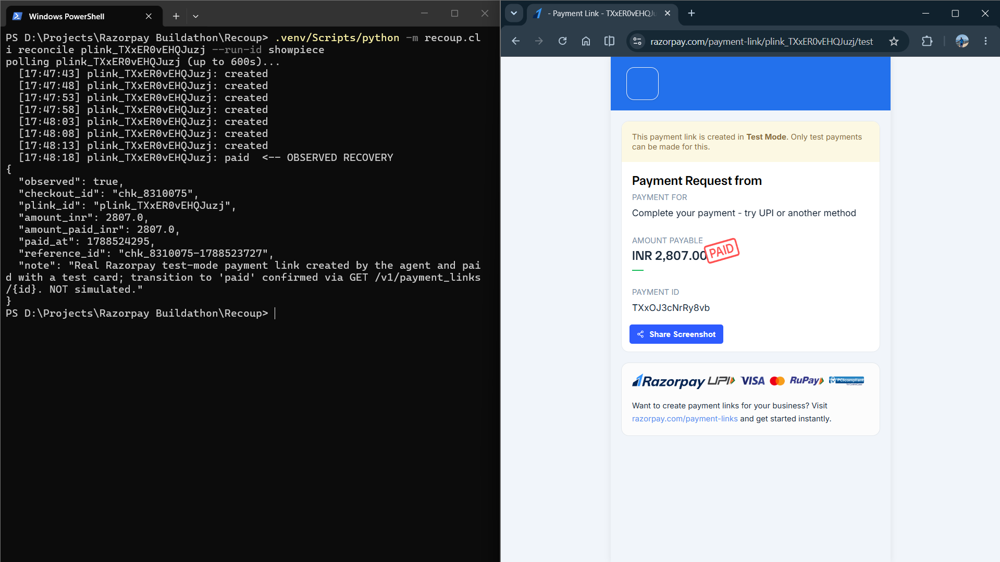
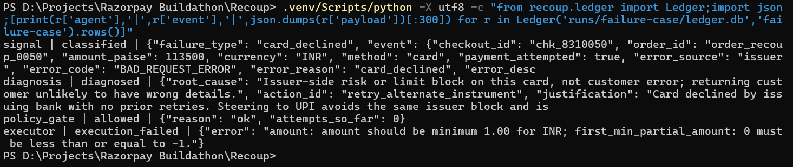
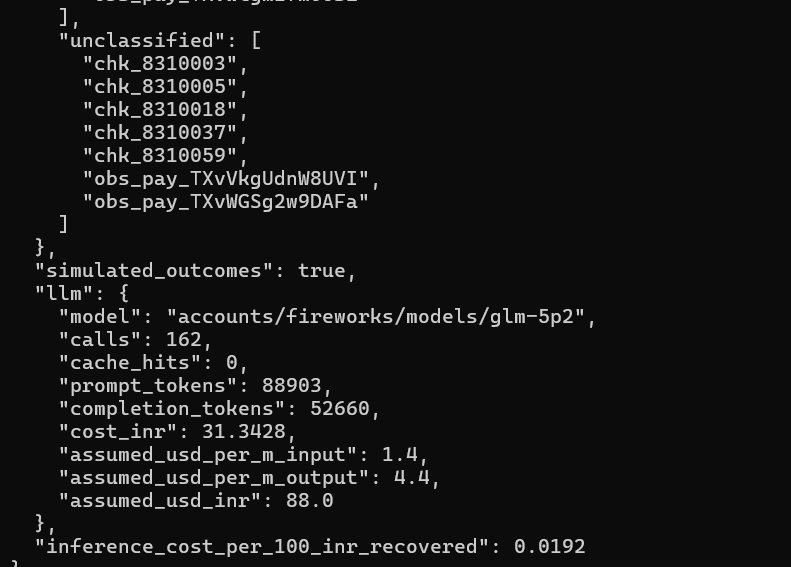
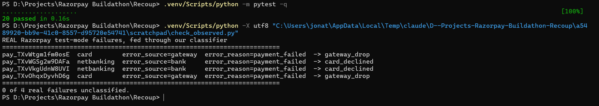
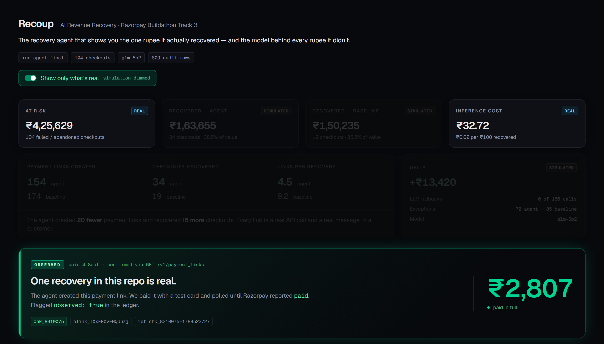

# Recoup: AI Revenue Recovery (Razorpay Buildathon, Track 3)

**The recovery agent that shows you the one rupee it actually recovered — and the model behind every rupee it didn't.**

> **104 failed/abandoned Razorpay checkouts, Rs 4,25,629 at risk.**
> Agent vs blind-retry baseline, identical seeded outcome draws per checkout.
>
> | | agent | baseline |
> |---|---|---|
> | Rs recovered *(simulated)* | **1,63,655** | 1,50,235 |
> | checkouts recovered | **34** | 19 |
> | recovery rate (value) | 38.45% | 35.30% |
> | payment links created | **154** | 174 |
> | exceptions | 70 | 85 |
> | LLM fallbacks | **0** | 0 |
>
> **The agent created 20 fewer payment links and recovered 15 more checkouts.**
> Every link is a real API call and a real message to a customer, so that ratio,
> 4.5 links per recovery vs 9.2, is the number a merchant should care about.
>
> **One recovery is not simulated:** Rs 2,807 on `chk_8310075`, a real Razorpay
> payment link created by the agent, paid with a test card, confirmed `paid` via
> `GET /v1/payment_links/{id}`.
>
> Total inference cost for the batch: **Rs 32.72**, or Rs 0.02 per Rs 100 recovered.

**▶ Live dashboard: [recoup-agent.vercel.app](https://recoup-agent.vercel.app)**

Batch replay across all 104 checkouts, the cumulative agent-vs-baseline chart, per-checkout
audit trails, the counterfactual, and the exception list. Every number on it is labelled REAL,
SIMULATED or OBSERVED — and one toggle dims everything that isn't real.

Recoup ingests a batch of failed and abandoned Razorpay checkouts, classifies why
each one died, diagnoses a root cause, picks one bounded recovery action from a
fixed menu, executes it against Razorpay test mode, and reports how much money it
won back, with a full audit trail, stopping rules enforced in code, and an
honest exception list.

---

## What's real and what's simulated

**1. Real input.** All 100 seeded checkouts are real Razorpay test-mode Orders
(`razorpay_order_id` in [data/events.json](data/events.json)). On top of those,
4 events are genuine `payment.failed` entities pulled from the API with Razorpay's
own error fields verbatim (`source: "observed"`), bringing the batch to 104. The
failure annotation on the 100 seeded events is synthetic and labelled
`source: "synthetic"`.

**2. Real calls.** The Executor creates genuine Razorpay Payment Links. The full
request and response are logged verbatim in the ledger, and the agent's own
reasoning rides along in the link's `notes` (`recoup_action`, `recoup_root_cause`).
That is visible in the Razorpay dashboard, not just in our logs.

**3. Observed outcome.** One recovery is closed end-to-end for real: `chk_8310075`,
Rs 2,807. The agent diagnosed an issuer-side decline, chose
`retry_alternate_instrument`, created `plink_TXxER0vEHQJuzj`, and we paid it with a
Razorpay test card. The transition to `paid` was observed by polling the API.
Flagged `observed: true`, `simulated: false` in the ledger. **The only
non-simulated recovery in this repo.**

**4. Simulated batch.** Every other outcome is drawn under a stated, seeded model
([config/recovery_model.json](config/recovery_model.json)). Assumptions are
published in that file, not buried. Draws are **paired** per
`(checkout_id, attempt_no)`, so both policies face identical luck on every
checkout and the delta is attributable to decisions rather than noise. No batch
number is claimed as observed.

Because draws are paired, every checkout has a defined result under *both*
policies, so we can name the exact checkouts where the agent's decision was the
difference: **16 the agent won, 1 the baseline won**, net Rs 13,420
(`python -m recoup.cli counterfactual agent-final baseline-final`).

### Reproduce our numbers, offline, with no API keys

Every LLM response is committed to [`.llm_cache/`](.llm_cache), keyed by
`sha256(model|system|user|attempt)`. A fresh clone replays the exact batch:

```bash
pip install -r requirements.txt
python -m recoup.cli run --policy agent --run-id verify
```

Expect `recovered_inr: 163655.0`, `calls: 0`, `cache_hits: 166`, and
`cost_inr: 32.7188`, identical to the committed run, with zero network calls.

We tested this the only way that counts: cloned the repo into an empty directory,
built a fresh venv, installed from `requirements.txt` and ran it with **no `.env`
at all**. Every field matched. That test found a real bug: the cost-model
defaults had drifted from the default model, so a reproducer would have seen
Rs 4.13 instead of Rs 32.72. Our own `.env` had been masking it. Fixed, and
[pinned with a test](tests/test_llm_cost.py) that fails if the rates and the
model ever diverge again.



---

## The evidence

Every rung of the ladder above has something you can look at.

| | |
|---|---|
| **Rung 1**: 100 real Razorpay Orders, receipts matching our `chk_` ids |  |
| **Rung 2**: the agent's own diagnosis stored in Razorpay's `notes`, in their dashboard |  |
| **Rung 3**: `created → paid`, Rs 2,807, terminal and browser in one frame |  |
| **Failure handling**: the full chain to Razorpay's real 400, Rs 0 claimed |  |

More in [docs/](docs): the payment-links list, the customer-facing checkout page,
and the classifier before/after below.

---

## What real data broke

Our classifier was written against synthetic error codes using
`error_source: "issuer"`. When we first fed it real Razorpay failures, both
netbanking declines fell through to `unclassified`. Razorpay emits `bank`, a
vocabulary we had never seen.

```
pay_TXvWGSg2w9DAFa  netbanking  error_source=bank  -> unclassified  <-- FELL THROUGH
pay_TXvVkgUdnW8UVI  netbanking  error_source=bank  -> unclassified  <-- FELL THROUGH
```

Before, and after the fix, on the same script, same real payloads:

| | |
|---|---|
|  |  |

That is the classifier working as designed: unknown codes go to the exception
list rather than being guessed at. We added `bank` rules **from observed payloads
only** and pinned them in [tests/test_signal.py](tests/test_signal.py). Razorpay
also documents `business` and `internal` as error sources; we have never received
either, so no rule guesses at them, and there is a test asserting they still land in
`unclassified`.

## What broke, and what we claimed for it

- **Forced execution failure** (`chk_8310050`): the executor sent a deliberately
  invalid amount and Razorpay rejected it with a real 400,
  `"amount should be minimum 1.00 for INR"`. Logged as `execution_failed`,
  **Rs 0 claimed.**
- **5 unclassified** checkouts never reached the LLM. No guess was made.
- **7 escalations to human** the agent chose on its own judgment.
- **0 LLM fallbacks** across 166 calls. Every diagnosis came from the model.

## Model selection, by measurement

`llama-v3p3-70b` is no longer serverless on Fireworks. Rather than swap in
whatever else was available, we benchmarked **9 serverless models** against our
own `Diagnosis` schema and stopping rules, then took 4 finalists across 6 events
spanning every failure type. `glm-5p2` was the only one combining 6/6 schema
validity with the highest agreement against our stated recovery model. Two
candidates failed on our own 500-character `justification` cap, a constraint the
prompt states and the code enforces.

## Scope

Checkout and payment failures only. **Not doing:** subscriptions, mandates,
B2B receivables, voice. Five days solo — one loop closed properly beats four
half-loops.

## Architecture

```
data/events.json (104 checkouts: 100 real orders + 4 observed failures)
   |
   v
Signal ── deterministic rules, NO LLM (error codes are a lookup problem)
   |
   v
Diagnosis ── the only LLM (glm-5p2 via Fireworks). Strict JSON contract,
   |          2 retries, then deterministic fallback recorded as llm_fallback.
   v
Policy gate ── pure functions, unit tested. Max 2 attempts / 30-min
   |            cooldown / no action under Rs 50 / menu enforcement.
   v
Executor ── real Razorpay Payment Links API. --dry-run for offline replay.
   |
   v
Outcome ── seeded, paired draws under a published model.
   |
   v
Ledger ── append-only SQLite audit log; every hop, verbatim.
```

Where we deliberately did **not** use an LLM: Signal (rules), the policy gate
(code), outcome accounting (seeded model). The LLM makes exactly one kind of
decision, choosing among five pre-approved actions, and its output is
validated, bounded, and gated before anything touches an API.

## The action menu (the LLM picks from this and nothing else)

See [config/actions.json](config/actions.json): retry on alternate instrument,
retry same after cooldown, recovery nudge, offer EMI, escalate to human
(with mandatory reason).

## Stopping rules (in code, not prompts: see recoup/policy.py + tests)

- Max **2** recovery attempts per checkout
- **30-minute** cooldown between attempts
- No action on amounts under **Rs 50**
- Unresolved after 2 attempts -> escalate and stop

One rule lives *only* in the prompt: EMI should not be offered below Rs 3,000.
Nothing in code enforces it. Across the benchmark and the full batch the model
respected it every time. We report that as an observation, not a guarantee.

## An assumption that flatters us, stated plainly

A second attempt that **repeats** the action which just failed decays harder
(`repeat_action_decay: 0.25`) than one that changes approach
(`second_attempt_decay: 0.6`). The baseline re-fires the same instrument by
definition, so it takes the harsher decay more often. We measured the effect:
it reduces the baseline by **1.7%**. Setting the two values equal reproduces the
neutral model. See `repeat_action_note` in
[config/recovery_model.json](config/recovery_model.json).

## Run it

```bash
pip install -r requirements.txt
python -m recoup.cli run --policy agent            # offline, uses committed cache
python -m recoup.cli run --policy baseline
python -m recoup.cli compare agent-final baseline-final
python -m recoup.cli counterfactual agent-final baseline-final
pytest tests/                                       # 24 tests
```

With keys (`.env` from `.env.example`):

```bash
python -m recoup.cli run --policy agent --only-checkout chk_XXXX --no-dry-run
python -m recoup.cli reconcile plink_XXXX --run-id <run>
```

## Dashboard

Live at **[recoup-agent.vercel.app](https://recoup-agent.vercel.app)**, or run it locally:

```bash
cd dashboard && npm install && npm run dev
```

Static Next.js reading the exported run JSONs, with no API and no keys. It renders the headline
comparison, a 104-cell batch replay, the cumulative agent-vs-baseline chart, the counterfactual,
every checkout's per-hop audit trail with verbatim API payloads, the forced failure case, and the
exception list. A "show only what's real" toggle dims every simulated number on the page; what
stays lit is Rs 4,25,629 at risk, Rs 32.72 of inference, and the one Rs 2,807 recovery.



The audit trail shown is the ledger table itself. Nothing is reconstructed after the fact.
